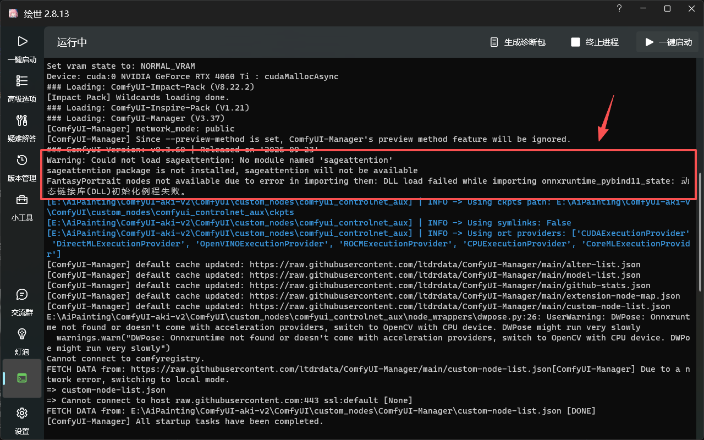
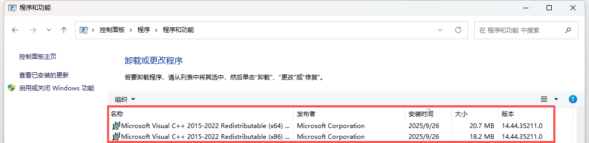
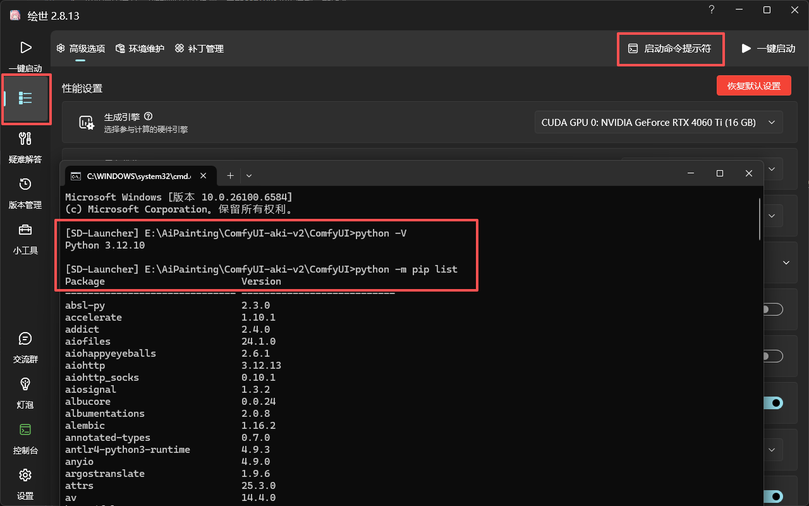
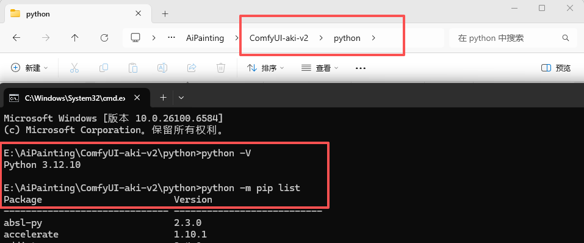
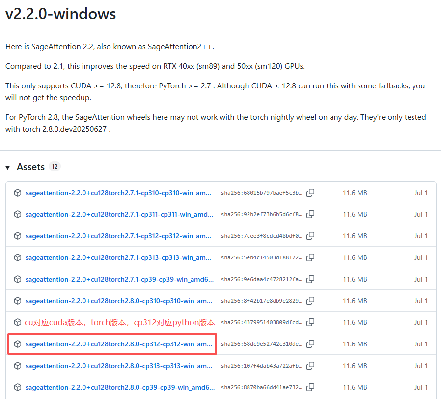
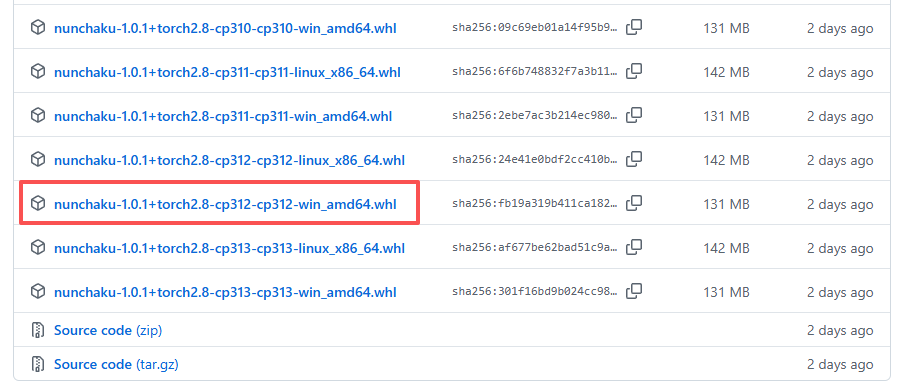

# 秋叶整合包本地安装
版本：ComfyUI-aki-v2  
解压密码：bilibili-秋葉aaaki

## 解压到本地，启动comfyui
1、根据网络情况，判断何时打开代理，更新comfyui和扩展到最新版本
- 根据情况，可在秋叶启动器里更新扩展，或者启动comfyui后，通过ComfyUI Manager更新

2、更新完成后，启动出现如图信息：



**上图所示，两个问题：**
  1. 模块缺失，缺少python模块，需要安装
  2. DLL初始化例程失败, 它通常意味着系统环境或依赖库方面存在问题


## DLL初始化例程失败

1、检查本地环境，安装 Visual C++ 可再发行组件包
- 下载 Microsoft Visual C++ 2019 Redistributable。通常需要同时安装x64和x86两个版本：[微软官网下载](https://learn.microsoft.com/uk-ua/cpp/windows/latest-supported-vc-redist?view=msvc-170#latest-supported-redistributable-version)
- **安装完成，需重启电脑**


2、若还是不行，需检查 Python 环境兼容性，Python版本与onnxruntime版本是否匹配

## 安装triton、sageattention、nunchaku
### 整合包内使用python安装模块
1、方式一：启动器→高级选项→启动命令提示符



2、方式二：进入整合包目录下，python目录，地址栏输入cmd进入



### triton
查看对应的版本[triton-windows](https://github.com/woct0rdho/triton-windows)，下载与python兼容的版本
```bash
python -m pip install -U "triton-windows<3.5"
```

### sageattention
1、下载[sageattention](https://github.com/woct0rdho/SageAttention/releases)到本地，下载正式版本，且版本要和本地环境保持一致。wheel文件名中有cp39-abi3，表示它们支持Python >= 3.9。



2、安装sageattention

```bash
python -m pip install 本地路径\sageattention-2.2.0+cu128torch2.8.0.post2-cp39-abi3-win_amd64.whl
```

### nunchaku
1、下载[nunchaku](https://github.com/nunchaku-tech/nunchaku/releases)到本地，下载正式版本，且版本要和本地环境保持一致



2、安装nunchaku

```bash
python -m pip install 本地路径\nunchaku-1.0.0+torch2.8-cp312-cp312-win_amd64.whl
```

3、安装[ComfyUI-nunchaku](https://github.com/nunchaku-tech/ComfyUI-nunchaku)

可通过启动器扩展安装，或者通过ComfyUI Manager安装

## 多个整合包共用一个models文件夹
### 方式一：修改comfyui配置文件
```yaml title="\ComfyUI\extra_model_paths.yaml"
#Rename this to extra_model_paths.yaml and ComfyUI will load it


#config for a1111 ui
#all you have to do is change the base_path to where yours is installed
a111:
    base_path: E:\AiPainting\sd-webui-aki-v4.10/

    checkpoints: models/Stable-diffusion
    configs: models/Stable-diffusion
    vae: models/VAE
    loras: |
         models/Lora
         models/LyCORIS
    upscale_models: |
                  models/ESRGAN
                  models/RealESRGAN
                  models/SwinIR
    embeddings: embeddings
    hypernetworks: models/hypernetworks
    controlnet: models/ControlNet

#config for comfyui
#your base path should be either an existing comfy install or a central folder where you store all of your models, loras, etc.

#comfyui:
#     base_path: path/to/comfyui/
#     # You can use is_default to mark that these folders should be listed first, and used as the default dirs for eg downloads
#     #is_default: true
#     checkpoints: models/checkpoints/
#     clip: models/clip/
#     clip_vision: models/clip_vision/
#     configs: models/configs/
#     controlnet: models/controlnet/
#     diffusion_models: |
#                  models/diffusion_models
#                  models/unet
#     embeddings: models/embeddings/
#     loras: models/loras/
#     upscale_models: models/upscale_models/
#     vae: models/vae/

#other_ui:
#    base_path: path/to/ui
#    checkpoints: models/checkpoints
#    gligen: models/gligen
#    custom_nodes: path/custom_nodes

```


### 方式二：创建符号链接实现共享
> :warning: **注意:** 更新comfyui版本后，共享文件夹链接会丢失，需要重新创建爱你链接。

1、准备共享 models 文件夹  
2、删除整合包内ComfyUI项目根目录下的 models 文件夹  
3、创建符号链接  
```bash
mklink /J "整合包路径\models" "共享模型文件夹路径"

mklink /J "E:\AiPainting\ComfyUI-aki-v2-test\ComfyUI\models" "E:\AiPainting\assets\models"
```
4、为每个ComfyUI整合包创建指向同一共享文件夹的符号链接

**多个整合包共用一个workflows、input、output文件夹**
1、准备共享 workflows、input、output 文件夹  
2、删除整合包内ComfyUI项目根目录下的相应文件夹
  - workflows文件夹,路径：\ComfyUI\user\default\workflows
  - input文件夹,路径：\ComfyUI\input
  - output文件夹,路径：\ComfyUI\output
3、创建符号链接  
```bash
mklink /J "整合包路径\models" "共享模型文件夹路径"

mklink /J "E:\AiPainting\ComfyUI-aki-v2-test\ComfyUI\user\default\workflows" "E:\AiPainting\assets\workflows"

mklink /J "E:\AiPainting\ComfyUI-aki-v2-test\ComfyUI\input" "E:\AiPainting\assets\input"

mklink /J "E:\AiPainting\ComfyUI-aki-v2-test\ComfyUI\output" "E:\AiPainting\assets\output"
```
4、为每个ComfyUI整合包创建指向同一共享文件夹的符号链接

